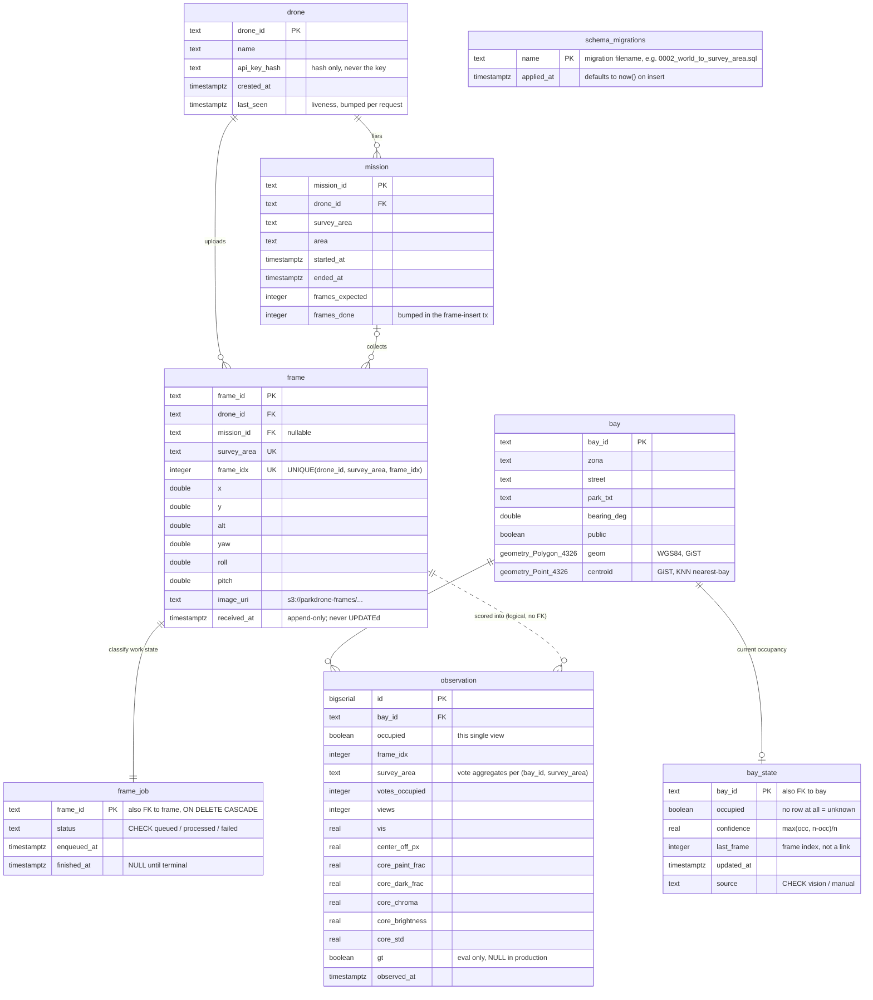

# Web-tier database schema (Postgres + PostGIS)

The schema for the stage-4 web product, defined by the migrations in
`web/packages/db/migrations/` (`0001_init.sql` creates it; `0002_world_to_survey_area.sql`
renames `world` → `survey_area`; `0003_split_frame_job.sql` splits the classify
queue out of `frame`) and applied with `pnpm db:migrate`.
Postgres is the **system of record**: the S3/MinIO bucket holds transient frame
pixels and the in-process `queue.Queue` holds transient jobs, but everything
durable lives here.

An editable draw.io version of the same diagram (crow's-foot notation, with the
design notes and a legend) lives next to this file: **`docs/db_schema_er.drawio`**
— same convention as `web/docs/architecture.drawio`.

## ER diagram

## What each table is for

| Table | Role |
|---|---|
| `drone` | Fleet registry and ingest auth. `api_key_hash` is looked up per request; `last_seen` is a liveness signal. |
| `mission` | One survey flight. `frames_expected`/`frames_done` back the progress readout. |
| `bay` | Static bay geometry seeded from `data/block_bays.geojson` (1698 bays). The only spatial authority. |
| `bay_state` | **The product.** One row per bay, majority vote over `observation`. What the map and the WebSocket clients reflect. |
| `observation` | Append-only evidence, one row per bay per frame, with the raw classifier features. Input to the vote *and* the audit trail. |
| `frame` | Ingest ledger: the immutable fact that a drone uploaded these pixels from this pose. Append-only — nothing ever UPDATEs it. |
| `frame_job` | The **durable classify queue** — what gives an in-memory queue at-least-once delivery. 1:1 with `frame`, holding only the mutable work state. |
| `schema_migrations` | Applied-migration ledger maintained by the runner (not in the SQL file). |

## Indexes

| Index | On | Why |
|---|---|---|
| `bay_geom_gix` | GIST(`bay.geom`) | bbox filtering — `geom && ST_MakeEnvelope(...)`, so the map fetches only the viewport |
| `bay_centroid_gix` | GIST(`bay.centroid`) | index-assisted KNN — `centroid <-> ST_MakePoint(...) LIMIT 1` for nearest-bay |
| `bay_zona_idx` | `bay(zona)` | per-zone filtering |
| `bay_state_updated_idx` | `bay_state(updated_at DESC)` | recently-changed feeds |
| `observation_bay_time_idx` | `observation(bay_id, observed_at DESC)` | bay-detail history |
| `observation_survey_area_idx` | `observation(survey_area, observed_at DESC)` | per-survey_area analytics |
| `frame_job_status_idx` | `frame_job(status, enqueued_at)` | crash-recovery scan for `status='queued'`, over a narrow table |
| `frame_mission_idx` | `frame(mission_id)` | mission progress |
| `mission_drone_idx` | `mission(drone_id, started_at DESC)` | flight history per drone |

## Schema decisions worth knowing

- **Bay ids are `int` in `block_bays.geojson` but `text` everywhere in the web tier.**
- **Geometry is stored in WGS84 (SRID 4326), never ENU.** The ENU-metre projection
  exists only in memory for pose math: `load_bays_enu` reads `ST_AsGeoJSON(geom)`
  once at startup and projects each ring with the shared `to_enu`. The projection
  constants must stay in lockstep with `sim/generate_world.py` and
  `packages/contracts`.
- **A missing `bay_state` row means "unknown", not "free".** Every read is a
  `LEFT JOIN bay_state USING (bay_id)`, and `/summary` counts unknown as
  `s.occupied IS NULL`. There is no third enum value.
- **`bay_state` is always derived, never incremented.** Each frame re-aggregates
  all of a bay's observations (`count(*)` / `sum(occupied)`) and upserts the
  result, so replays and out-of-order frames converge to the same answer.
- **`UNIQUE (drone_id, survey_area, frame_idx)` makes ingest idempotent.** A re-sent frame
  overwrites its S3 object in place but is not re-enqueued; to reprocess a survey area,
  clear its `frame` rows first.
- **`frame_job.status` is the durability mechanism.** `frame` + `frame_job` are
  committed in one transaction *before* the in-memory job is enqueued, so a crash
  in between leaves `status='queued'` and startup recovery rebuilds the job by
  joining `frame_job` back to `frame`, plus S3.
- **`frame` and `frame_job` are split by lifecycle, not by subject.** They
  describe the same thing, but one is an immutable fact written once and the
  other is work state rewritten on every frame. Keeping them apart lets the
  ledger stay append-only and lets the hot recovery scan touch four narrow
  columns instead of fifteen. A duplicate ingest creates **no** job row, which is
  what makes a re-send not re-enqueue work.
- **No FK between `frame` and `observation`** — they are joined only logically by
  `(survey_area, frame_idx)`, because observations must outlive frame rows
  you delete to reprocess a survey area.
- **`observation.gt` is evaluation-only.** Production has no ground truth; the
  column is populated only by the offline replay harness.
