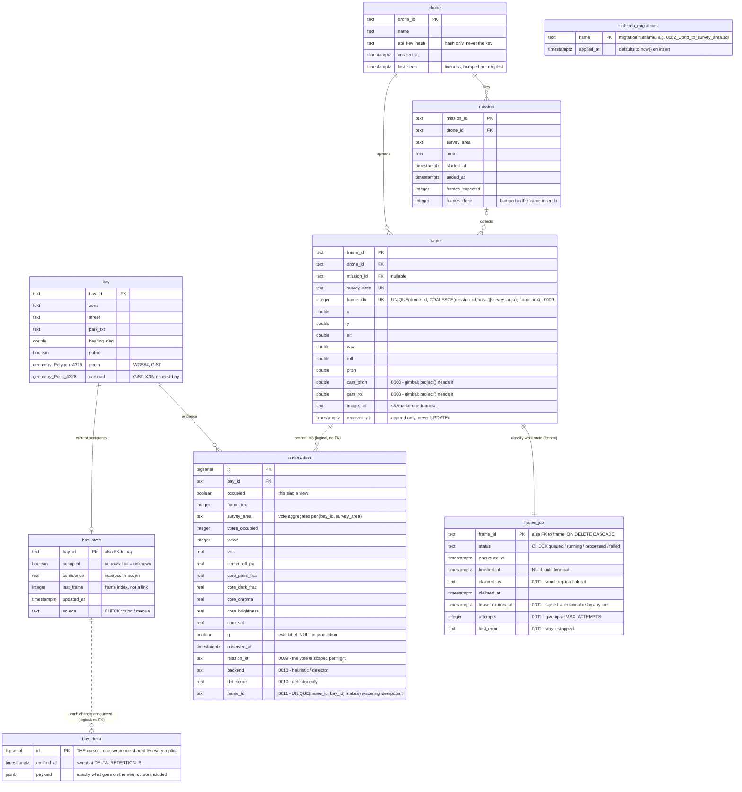

# Web-tier database schema (Postgres + PostGIS)

The schema for the stage-4 web product, defined by the migrations in
`web/packages/db/migrations/` (`0001_init.sql` creates it; `0002_world_to_survey_area.sql`
renames `world` → `survey_area`; `0003_split_frame_job.sql` splits the classify
queue out of `frame`; `0009` re-keys ingest per mission; `0011_multi_replica.sql`
adds job claiming, idempotent observations and the shared delta log) and applied
with `pnpm db:migrate`.
Postgres is the **system of record**: the S3/MinIO bucket holds transient frame
pixels and the in-process `queue.Queue` holds transient jobs, but everything
durable lives here.

An editable draw.io version of the same diagram (crow's-foot notation, with the
design notes and a legend) lives next to this file: **`docs/db_schema_er.drawio`**
— same convention as `web/docs/architecture.drawio`.

## ER diagram

## What each table is for

| Table | Role |
|---|---|
| `drone` | Fleet registry and ingest auth. `api_key_hash` is looked up per request; `last_seen` is a liveness signal. |
| `mission` | One survey flight. `frames_expected`/`frames_done` back the progress readout. |
| `bay` | Static bay geometry seeded from `data/block_bays.geojson` (1698 bays). The only spatial authority. |
| `bay_delta` | The **shared WebSocket replay log** (`0011`). One row per `bay_state` change, written in the same transaction as the change and announced with `pg_notify`. Its `id` is the `?since=` cursor, so a reconnect means the same thing on every replica; the table replaced a per-process deque and a per-process counter that restarted at 0 each boot. A tail, not history — swept at `DELTA_RETENTION_S`. |
| `bay_state` | **The product.** One row per bay, majority vote over `observation`. What the map and the WebSocket clients reflect. |
| `observation` | Append-only evidence, one row per bay per frame, with the raw classifier features. Input to the vote *and* the audit trail. |
| `frame` | Ingest ledger: the immutable fact that a drone uploaded these pixels from this pose. Append-only — nothing ever UPDATEs it. |
| `frame_job` | The **durable, claimable classify queue** — what gives an in-memory queue at-least-once delivery. 1:1 with `frame`, holding only the mutable work state. Since `0011` a row is *leased* rather than merely flagged, so several replicas can share one backlog and a live one can take over a dead one's work. |
| `schema_migrations` | Applied-migration ledger maintained by the runner (not in the SQL file). |

## Indexes

| Index | On | Why |
|---|---|---|
| `bay_geom_gix` | GIST(`bay.geom`) | bbox filtering — `geom && ST_MakeEnvelope(...)`, so the map fetches only the viewport |
| `bay_centroid_gix` | GIST(`bay.centroid`) | index-assisted KNN — `centroid <-> ST_MakePoint(...) LIMIT 1` for nearest-bay |
| `bay_zona_idx` | `bay(zona)` | per-zone filtering |
| `bay_state_updated_idx` | `bay_state(updated_at DESC)` | recently-changed feeds |
| `observation_bay_time_idx` | `observation(bay_id, observed_at DESC)` | bay-detail history |
| `observation_survey_area_idx` | `observation(survey_area, observed_at DESC)` | per-survey_area analytics |
| `observation_bay_area_time_idx` | `observation(bay_id, survey_area, observed_at DESC)` | the windowed occupancy vote, once per classified frame — bounded index range scan |
| `observation_gt_idx` | `observation(bay_id, observed_at DESC) WHERE gt IS NOT NULL` | **partial** — the model-accuracy readings. Labelled rows are a small minority (none at all in production), so the index holds only them and accuracy queries cost what the eval set costs, not what the whole history costs |
| `frame_job_status_idx` | `frame_job(status, enqueued_at)` | status counts for the ops dashboard, over a narrow table |
| `frame_job_claimable_idx` | `frame_job(enqueued_at) WHERE status = 'queued'` | **partial** — the claim scan (`FOR UPDATE SKIP LOCKED`, oldest first). Unclaimed work is the small minority of a retained backlog, so the index holds only it |
| `frame_job_lease_idx` | `frame_job(lease_expires_at) WHERE status = 'running'` | **partial** — the reaper arm of the same claim query: leases nobody renewed |
| `observation_frame_bay_key` | `observation(frame_id, bay_id) WHERE frame_id IS NOT NULL` | **partial UNIQUE** — makes re-scoring a frame a no-op instead of a doubled vote. Partial so pre-`0011` rows (NULL `frame_id`) do not collide with each other |
| `bay_delta_emitted_idx` | `bay_delta(emitted_at)` | the retention sweep |
| `frame_received_idx` | `frame(received_at)` | the retention sweep, which would otherwise scan the whole ingest ledger every pass |
| `frame_mission_idx` | `frame(mission_id)` | mission progress |
| `mission_drone_idx` | `mission(drone_id, started_at DESC)` | flight history per drone |

## Schema decisions worth knowing

- **Bay ids are `int` in `block_bays.geojson` but `text` everywhere in the web tier.**
- **Geometry is stored in WGS84 (SRID 4326), never ENU.** The ENU-metre projection
  exists only in memory for pose math: `load_bays_enu` reads `ST_AsGeoJSON(geom)`
  once at startup and projects each ring with the shared `to_enu`. The projection
  constants must stay in lockstep with `sim/generate_world.py` and
  `packages/contracts`.
- **A missing `bay_state` row means "unknown", not "free".** Every read is a
  `LEFT JOIN bay_state USING (bay_id)`, and `/summary` counts unknown as
  `s.occupied IS NULL`. There is no third enum value.
- **`bay_state` is always derived, never incremented.** Each frame re-aggregates
  all of a bay's observations (`count(*)` / `sum(occupied)`) and upserts the
  result, so replays and out-of-order frames converge to the same answer.
- **`UNIQUE (drone_id, survey_area, frame_idx)` makes ingest idempotent.** A re-sent frame
  overwrites its S3 object in place but is not re-enqueued; to reprocess a survey area,
  clear its `frame` rows first.
- **A `frame_job` row is a LEASE, not an assignment** (`0011`). `claim_frames` takes rows with
  `FOR UPDATE SKIP LOCKED` and stamps `claimed_by` + `lease_expires_at`; the same query's second arm
  takes back anything whose lease lapsed. That is what makes N replicas safe *and* what makes
  recovery better than it was — a crashed replica's work is picked up by a live one within
  `LEASE_S`, instead of waiting for the dead process to restart. `attempts`/`last_error` are the
  give-up path: before them, a job that failed for any reason other than a missing image stayed
  `queued` forever and was re-run on every restart.
- **`observation` is idempotent per `(frame_id, bay_id)`, and the unique index is the only place
  that could guarantee it.** Claiming stops two replicas scoring one frame at once; it cannot stop
  the same frame being scored twice in sequence, and that window is structural — observations commit,
  then `frame_job` is marked processed in a *separate* transaction, so a crash between them leaves
  the job reclaimable. Without the key that silently double-counts the vote.
- **`frame_job.status` is the durability mechanism.** `frame` + `frame_job` are
  committed in one transaction *before* the in-memory job is enqueued, so a crash
  in between leaves `status='queued'` and startup recovery rebuilds the job by
  joining `frame_job` back to `frame`, plus S3.
- **`frame` and `frame_job` are split by lifecycle, not by subject.** They
  describe the same thing, but one is an immutable fact written once and the
  other is work state rewritten on every frame. Keeping them apart lets the
  ledger stay append-only and lets the hot recovery scan touch four narrow
  columns instead of fifteen. A duplicate ingest creates **no** job row, which is
  what makes a re-send not re-enqueue work.
- **No FK between `frame` and `observation`** — they are joined only logically by
  `(survey_area, frame_idx)`, because observations must outlive frame rows
  you delete to reprocess a survey area.
- **`observation.gt` is evaluation-only, and now actually written.** It is filled
  in `processing/pipeline.py` from `sim/worlds/<area>.ground_truth.json` via
  `vision/ground_truth.py`, so live ingest and the offline replay both record it
  — accuracy is measured on the path production runs, not on a test-only one. A
  survey area with no labels file (every real deployment) records `NULL`, and the
  `/metrics` accuracy figures then report `null` — unknown, never `0`. Before
  2026-08-03 the column existed and was plumbed through `insert_observations` but
  no caller ever passed a value, so it was NULL everywhere.
