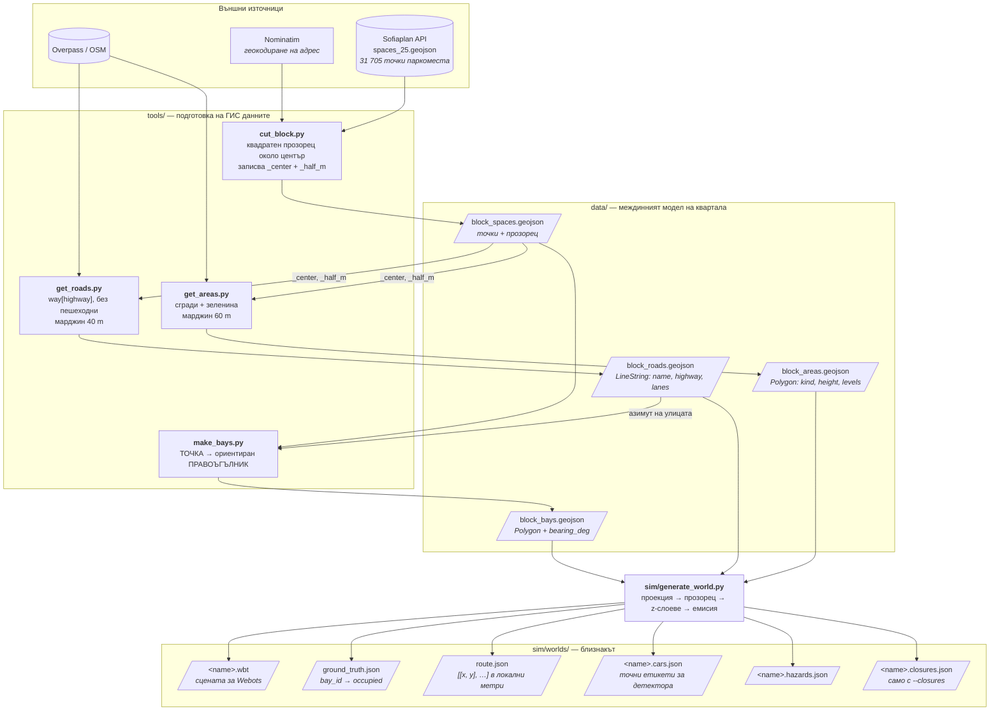
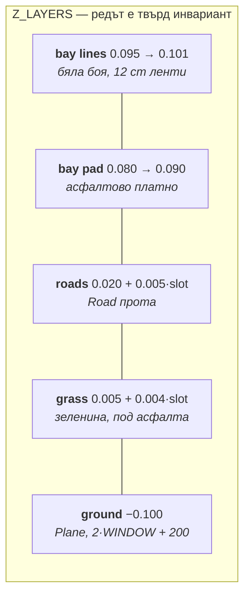
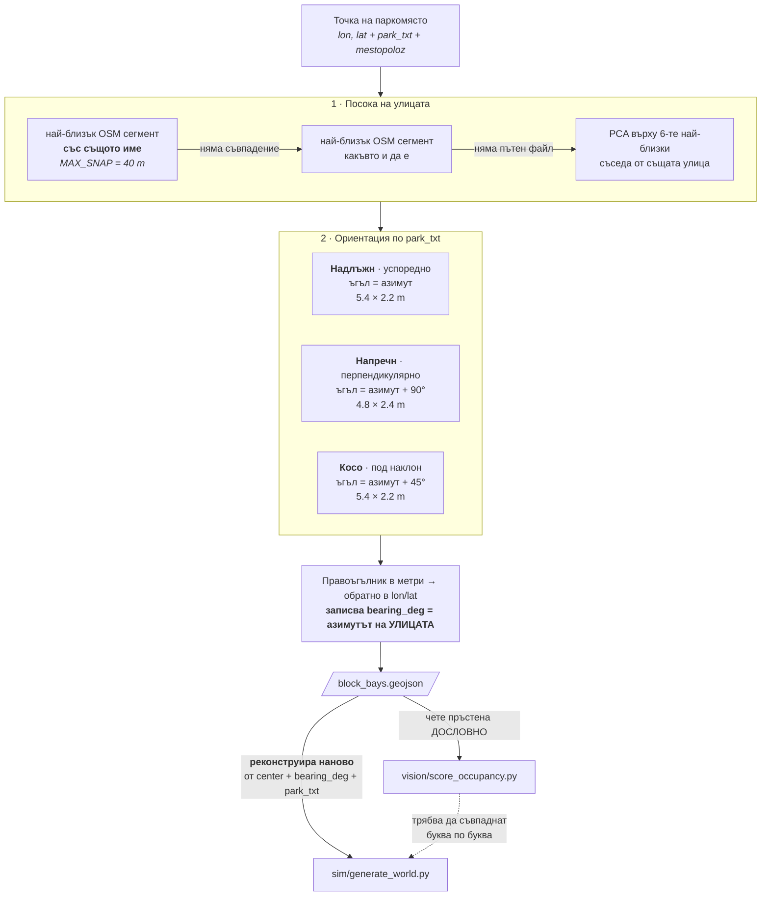

# Дигиталният близнак на квартал Лозенец

*Как реален градски квартал става симулационен свят: кои данни влизат, какво се
реконструира и какво остава невярно.*

Този файл описва **стъпка 1–2 от конвейера** (`tools/` → `sim/generate_world.py`) от
гледна точка на дигиталния двойник. Механиката на полета, класификатора и уеб слоя са
в `CLAUDE.md`; тук е въпросът *какво точно се копира от града и с каква вярност*.

Свързани: `docs/bay_data_gap.md` (защо засечените коли не стават заети места),
`docs/bay_geometry_verification.md` (проверката на геометрията),
`docs/occupancy_classifier.md`, `docs/webots_1km_performance.md`.

---

## 1. Общата рамка

Дигиталният близнак тук стои на **един-единствен георефериран гръбнак**: свят, маршрут,
пози на дрона, ground truth и уеб слоят живеят в едни и същи локални метри.

```
ORIGIN = (42.6747105, 23.3298956)          # sim/generate_world.py
mlat = 111320.0
mlon = 111320.0 * cos(lat0)
x = (lon - lon0) * mlon                    # ENU, изток
y = (lat  - lat0) * mlat                   # ENU, север;  z нагоре
```

`ORIGIN` е **закован** — центроидът на първоначалния 250 m разрез около ФМИ — за да не се
измести отправната система, когато данните се прережат с друг размер на прозореца. Вече
летени светове и техните `poses.json` остават сравними.

**ENU = East, North, Up** — `x` на изток, `y` на север, `z` нагоре. Изборът не е случаен:
Webots R2023b работи в ENU по подразбиране, така че локалната система на проекта **е**
координатната система на сцената и няма преобразуване между двете. (Авиационната
алтернатива NED би обърнала знака на `z` и рано или късно щеше да го обърне на грешното
място.) Формално това е *local tangent plane* — равнина, допирателна към елипсоида в
`ORIGIN`.

Причината изобщо да се излиза от градусите: те не са метри и мащабът им зависи от
ширината — тук 1° ширина ≈ 111.1 km, но 1° дължина ≈ 81.8 km, така че правоъгълник в
градуси не е правоъгълник на земята. Освен това ширината на паркомясто е 2.2 m =
0.0000269°, число, което не се чете и не се дебъгва.

**Цената на плоското приближение е чиста МАЩАБНА грешка, и тя не е нулева.** Кодът ползва
константи вместо истинските дължини на дъга по WGS84: `mlat` 111 320 срещу 111 086.4
(**+0.210 %**) и `mlon` 81 844.0 срещу 81 969.8 (**−0.153 %**). Отклонението расте с
разстоянието от `ORIGIN`:

| разстояние от ORIGIN | север | изток |
|---|---|---|
| 75 m (калибрационният свят) | +0.16 m | −0.12 m |
| 130 m (`fmi_block_obst`) | +0.27 m | −0.20 m |
| 500 m (ръбът на 1 km света) | **+1.05 m** | **−0.77 m** |

Това не е дефект по две причини. В симулацията се **самосъкращава напълно** — свят,
места, маршрут и пози се строят и оценяват с едни и същи константи, значи мащабът е общ
множител, който никога не влиза в разлика. При реалните полети остава **относителен**:
GPS позата и координатите на местата минават през същата проекция, върху блок от ~200 m
относителното изместване е под 0.3 m, което е шум на фона на 3.14 m напречна грешка в
самите данни на Sofiaplan (§7.1). Значимо става само при сравнение с **външен абсолютен**
източник върху цялото 1 km поле.

**Същата константа е копирана на четири места** — `generate_world.py`,
`controllers/parkdrone/parkdrone.py`, `vision/score_occupancy.py` и
`web/packages/contracts`. Това е съзнателна дублирана дефиниция, не пропуск: няма общ
Python/TypeScript слой между сима и уеб тира. `tools/check_consistency.py` проверява, че
не са се разминали.

---

## 2. Потокът на данните



**Само паркоместата са „градски" данни; всичко останало е OSM.** Това е и мястото на
най-голямата слабост на близнака (§7).

**Прозорецът тече надолу по веригата.** `cut_block.py` записва `_center` и `_half_m` в
самия GeoJSON; `get_roads.py` и `get_areas.py` ги четат и питат Overpass със същия bbox
плюс марджин. Марджините не са произволни: `generate_world.py` пази сграда цяла по
центроид в `WINDOW + 40`, значи извличането трябва да е поне толкова широко — иначе
сграда на ръба липсва, вместо да е отрязана.

---

## 3. Улиците

**Заявката** (`get_roads.py`) е `way["highway"]` с изричен изключващ филтър:
`footway|path|steps|cycleway|pedestrian|service|track|construction`. Тоест **само
проходими улици**, защото мрежата има двойна употреба — рисува се като асфалт *и* служи
за граф на маршрута на дрона.

Скриптът прави и **само-проверка на имената**: сверява `mestopoloz` на паркоместата срещу
OSM `name` и печата кои улици не се напасват (2 от 49 в 1 km разреза). Именно затова
затварянията на улици се матчват **по геометрия, а не по име** — вж. `CLAUDE.md` §2h.

В света (`generate_world.py`):

1. Проекция със същите `lon0/lat0`.
2. **Liang-Barsky клипване по СЕГМЕНТИ** (`clip_segment` / `clip_polyline`), не филтриране
   на точки. OSM слага възли предимно по кръстовищата, така че улица, която *пресича*
   прозореца без възел в него, изчезва при наивно филтриране по точки.
3. Ширина (`road_width`): `max(5.0, 3.25 * lanes)`; при липсващ таг — 9 m за
   `primary|secondary|tertiary`, иначе 6.5 m.
4. Емисия като Webots `Road` прото с пунктирана осева линия, **без bounding object** —
   физиката остава непокътната.

### Защо има z-слоеве

Всичко, боядисано по земята, е копланарно, а сцената е километър широка: депт-буферът не
може да раздели повърхности на милиметри и те трептят една срещу друга при движение на
камерата. Затова има фиксиран стек:



**Слотът се раздава с greedy оцветяване на графа на застъпванията**, а не като стъпало „по
един z на път". Наивното стъпало прераства платната при достатъчно пътища: в 1 km света
асфалтът покри цели надлъжни редове места и произведе **330 фалшиви позитива** за
заетост. При greedy оцветяване пътят получава най-ниския слот, неизползван от пресичащите
го пътища — максималният z зависи от степента на кръстовището, не от броя пътища. Същият
механизъм се прилага и между зелените площи, защото OSM реално влага морава в парк в гора.

Генераторът предупреждава, ако слот на трева достигне слоя на пътищата или слот на път
достигне слоя на платната.

---

## 4. Паркоместата: от точка към правоъгълник

Това е концептуално най-интересната стъпка. **Градските данни са ТОЧКИ, а физическият
обект е ориентиран правоъгълник — ориентацията не съществува в източника и се
реконструира.**



**Предпочитанието към сегмент със същото име не е козметика:** без него места на ъгъл се
залепват за напречната улица и цял ред излиза завъртян на 90°.

**Двойната реконструкция е капан, който вече е щракал.** Генераторът рисува от
(център, азимут, L, W), докато скорерът чете пръстена дословно от GeoJSON — двете
интерпретации трябва да са идентични. Случаят `Косо` липсваше в генератора и падаше в
успоредния клон: **12 места в 1 km света бяха завъртени на 45° спрямо собствената си
боя**, с 2.23 m грешка в ъгъла. Симптомът беше „класификаторът бърка", причината беше
разминаване в геометрията.

### Външният вид на клетката

Мястото се рисува като **асфалтово платно с тънък бял ОЧЕРТАН контур** (12 cm ленти), не
като запълнен бял правоъгълник. Запълненият вариант правеше свободно/заето тривиално
разделимо по цвят и същевременно правеше белите коли невидими — нереалистично и в двете
посоки.

Платната и линиите се сливат в **два `IndexedFaceSet` възела**, не 5 `Solid`-а на място:
един Webots `Solid` струва ~0.145 MB RSS независимо от геометрията, така че 1593 места в
1 km света хабяха ~1.1 GB върху плоски правоъгълници. Квадратите се навиват
обратно-часовниково, за да гледат нормалите нагоре към надирната камера.

---

## 5. Наслагването върху OSM: сгради и зеленина

`get_areas.py` тегли `building`, `landuse=grass|meadow|forest`, `leisure=park|garden`,
`natural=scrub|wood`. Две съзнателни изпускания, **докладвани, не скрити**:

- **multipolygon релациите се пропускат.** Нито един консуматор не може да изрази дупки —
  Webots `SimpleBuilding` приема един пръстен `corners` — така че релацията би се
  отрисувала като запълнено петно, тоест *грешно*, а не просто липсващо.
- **незатворените ways се пропускат** — те са линии, а не площи.

Височинните тагове се преписват **суров текст**; `parse_height()` в генератора ги
интерпретира. Същото разделение като `lanes` → `road_width()`: извличането не тълкува.

### Двата типа се прозорцират РАЗЛИЧНО, и това е принципно

| | зеленина | сграда |
|---|---|---|
| същност | боя по земята | 3D обект |
| прозорец | **КЛИПВА се** (Sutherland-Hodgman), `WINDOW + 10` | пази се/маха се **ЦЯЛА** по центроид, `WINDOW + 40` |
| защо | некликнат 1 km парк би покрил цялата видима земя на 75 m свят | клипнат отпечатък може да се върне самодопиращ се, което чупи триангулацията на покрива |
| геометрия | ear-clipping триангулация | `SimpleBuilding` приема пръстена директно |

Останалото, което си струва да е в текста:

- **Зеленината е на z = 0.005** — над земята, но **под** пътищата. Парк, пресичащ улица,
  минава под асфалта и никога не може да покрие паркинг-клетка. Предсказаният ефект
  „места върху трева объркват класификатора" **не се случи**: и 33-те такива места се
  класифицираха вярно, защото платното (0.080) боядисва над зеленото.
- **Плоски покриви.** Софийски панел — и това е точно каквото вижда надирната камера.
  Заедно с това избягва прото-то да изроди „пирамидален покрив" върху всеки реален
  Г-образен отпечатък.
- **Без bounding object по подразбиране.** Контролерът лети фиксирани 30 m без логика за
  препятствия, така че колизионна геометрия би го разбила. Обратната страна: Webots range
  сензорите виждат **само** възли с bounding object — затова `--collide` е входната точка
  на целия слой за избягване на препятствия.
- **Уличните стълбове са ПРОЦЕДУРНИ**, не от OSM `highway=street_lamp`: тези възли почти
  не са картографирани в София, така че по-голямата част от квартала би останала без
  осветление, а плътността би варирала с прозореца по причини извън наш контрол.
  Обхождането на центролиниите слага стълб точно там, където има значение — на бордюра, до
  реда паркоместа.

---

## 6. Какво излиза от генератора

| файл | съдържание | консуматор |
|---|---|---|
| `<name>.wbt` | сцената | Webots |
| `ground_truth.json` | `bay_id → occupied` | оценяване на детекцията |
| `route.json` | `[[x, y], …]` в локални метри | контролерът на дрона |
| `<name>.cars.json` | всяка паркирана кола: bay, модел, център, ъгъл, L, W | **точни етикети за детектора, без ръчно анотиране** |
| `<name>.hazards.json` | конструкции, достигащи 30 m в рамките на 10 m от маршрута | слоят за препятствия |
| `<name>.closures.json` | затворени улици (само с `--closures`) | сверяване sim ↔ карта |

### Заетостта следва геометрията, а не обратното

`occupied = public && random() < OCC`, но след това колата трябва физически **да се
побере**: пробват се модели от желания надолу към по-къси, а ако и най-малката се застъпва
със съсед (separating-axis тест, `CAR_GAP = 0.35 m`), клетката **се освобождава и ground
truth се пренаписва**. Това не е защитно програмиране — на бул. Джеймс Баучер изходните
точки са на ~4.5 m една от друга, по-тясно от собствената си боя.

### Три отделни RNG потока

| поток | seed | какво определя |
|---|---|---|
| `random` (модулен) | 42 | ground truth: кое място е заето |
| `rng_cars` | 7 | модел, цвят, ориентация на носа |
| `rng_scene` | 11 | козметика: тип стена, тип покрив, отенък на тревата |

Целта е **детерминизъм по слоеве**: промяна в декора не може да размести нито една кола.
Инвариантът, който се проверява след всяка промяна в генератора — трите survey свята се
регенерират **байт за байт идентични**, и `ground_truth.json` / `route.json` не мърдат.

Свързан инвариант: **Webots прогоните са детерминистични** (8/8 идентични повторения), така
че променено число за точност винаги означава променен *свят или контролер*, никога шум.

---

## 7. Границите на близнака

Задължителни за честна документация — всяко от тези е измерено, не предположено.

1. **Геометрията на паркоместата е грешна с повече от ширина на клетка**, и няма твърда
   корекция, която я оправя: глобално отместване 3.99 → 3.59 m, по улици → 3.35 m, по
   страна на реда → 2.84 m. Грешката е **анизотропна** — 3.14 m напряко на улицата срещу
   1.64 m по улицата. Точно затова примитивът беше сменен от правоъгълник на **1-D
   бордюрен участък** (`CLAUDE.md` §2h): напречната компонента избира *кой* участък, а
   надлъжната само плъзга колата по бордюра, където дължината на празнина е инвариантна.
2. **4 от 5 реално засечени коли не се напасват на нито едно картографирано място** — дори
   в полета, който работи (599 детекции, 473 неатрибуирани). Това е дупка в **данните**, не
   в детектора. Подробно: `docs/bay_data_gap.md`.
3. **Симулационната светлина е плоска.** Всяко число за точност е мерено при
   `castShadows FALSE` и слънце на ~60°. Слънце на 25° сваля евристиката от 100% на 44.1%,
   и **никаква нормализация не я спасява** — при по-ниско слънце по-голяма част от
   светлината идва от оцветеното небе, тоест сменя се СПЕКТЪРЪТ. Това е аргумент **за**
   научен детектор, а не срещу симулацията: `--sun` / `--shadows` генерират евтино
   разнообразно осветление с точни етикети.
4. **20 места в 1 km света са под сгради** и са непроверими по конструкция (камерата вижда
   покрив); 222 двойки места се застъпват в масива от 1698.
5. **Близнакът е геометричен, не радиометричен.** Маската за наблюдение казва, че
   бордюрът е бил *в кадър*, не че е бил *видим* — кадър изцяло под лятна корона минава
   проверката. `observed_fraction` е горна граница.
6. **Прототипната кола не е нискополигонна.** `--lowpoly` сменя вида на колата, значи сменя
   и **какво означава** числото за точност: тъмна кутия върху тъмен асфалт няма фуги,
   стъкло и сянка под купето, на които се опира евристиката. Никога за калибрационните
   светове.

---

## 8. Команди

```bash
# 1. Разрез на квартала (адрес или lat,lon; 200 = половин размер в метри)
cd tools
python cut_block.py "бул. Джеймс Баучер 5, София" 200

# 2. OSM слоеве за същия прозорец
python get_roads.py
python get_areas.py

# 3. Точки → ориентирани правоъгълници (иска block_roads.geojson за азимутите)
python make_bays.py

# 4. Светът
cd ../sim
python generate_world.py 75 0.5                       # калибрационният свят
python generate_world.py 500 0.5 fmi_block_1km        # 1 km
python generate_world.py 75 0.5 fmi_block_shd --shadows --sun 135,25

# 5. Проверка, че дублираните константи не са се разминали
python ../tools/check_consistency.py
```

`make_bays.py` пише и `block_bays.html` (Leaflet върху OSM) и
`block_bays_preview.png` (120 m прозорец) — **ориентацията се проверява с очи преди
каквото и да е число**, същата дисциплина като `vision/diag/real_align.py` при реалните
полети.
