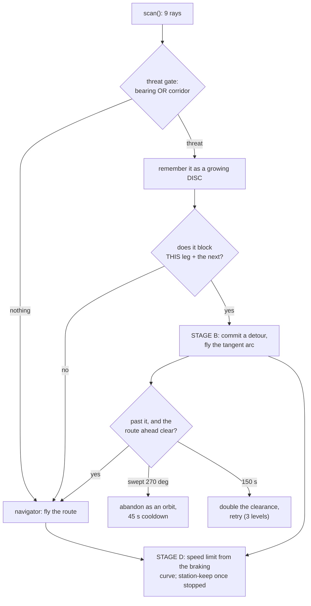

# Obstacle avoidance — how it works

Written 2026-08-20, describing `sim/controllers/parkdrone/parkdrone.py` as it stands after the orbit
fix. This is the *explanation*: what the layer does, in pseudocode, and why each piece is shaped the
way it is. The decision record that preceded it is
[`obstacle_avoidance_options.md`](obstacle_avoidance_options.md); the constants and the full failure
log live in `CLAUDE.md`.

The drone surveys parking bays from **30 m** along a fixed route. Everything the avoidance layer does
has to leave that survey intact, and that drives the whole design:

- **It steers, it does not climb.** The occupancy classifier is calibrated at 30 m; changing altitude
  to clear a building would change what every frame means.
- **It writes only into channels the stabilizer already has** — the aim *heading* (`yaw_err`) and the
  forward *speed target* (`v_des`). It never issues a lateral position command, so the "roll-strafe
  tumbles the drone" invariant survives by construction rather than by testing.
- **It is absent unless the world was built with `--collide`.** Survey worlds carry no ray fan,
  `getDevice` returns `None`, and every branch below is skipped — verified by re-flying
  `fmi_block_4st` and getting poses identical to the golden fixture to 0.000000 m.

Two stages, layered, both live at once:

| | question it answers | what it emits | on its own |
|---|---|---|---|
| **Stage D** — *detect & stop* | is something in front of me? | a speed limit, then a station-keep | drone halts 12 m short; the patrol never finishes |
| **Stage B** — *steer around* | is something across my route? | an aim heading (a tangent arc) | drone rounds it and rejoins the route |

Stage D is the safety floor and is never switched off. Stage B is the useful behaviour on top of it.



---

## 1. Sensing

A **fan of 9 single-ray `DistanceSensor`s**, ±40°, 80 m, mounted in the Mavic2Pro's `bodySlot` by
`generate_world.py` when `--collide` is passed. `DS_N` / `DS_SPREAD_DEG` / `DS_RANGE` are duplicated
in the generator and the controller and must be kept in step (same convention as `ORIGIN`).

**80 m is a dynamics spec, not a perception one.** Braking authority is ~0.22 m/s² (tilt is capped at
~2°, and there is no aerodynamic drag in the sim), so stopping from `V_MAX` = 5 m/s takes `v²/2a` ≈
57 m. A 40 m rangefinder cannot stop this aircraft at any level of algorithmic cleverness.

```
function scan():
    threat = (inf, 0)          # closest return that could actually hit us
    raw    = inf               # closest return of any bearing (diagnostics only)
    rays   = []                # the WHOLE fan, kept for stage B's side choice
    for (bearing, sensor) in fan:
        r = sensor.value()
        rays.append((bearing, r))
        if r >= DS_RANGE - 0.5:                  # "nothing out there", not a hit at max range
            continue
        raw = min(raw, r)
        # THREAT GATE. The fan is 80 deg wide, so most of what it sees is scenery we
        # will fly PAST, not into. A return counts only if it is roughly ahead, or --
        # at close range -- laterally inside the corridor we occupy. The bearing
        # clause has to carry the long range: at 68 m even 10 deg is 12 m of lateral
        # offset, so a pure corridor test would reject the very structure the route
        # is curving toward.
        if |bearing| > OBST_BEARING and |r*sin(bearing)| > OBST_CORRIDOR:
            continue
        threat = min(threat, (r, bearing))
    return threat, raw, rays
```

*Why the gate exists:* braking on the raw closest return was tried first. The −40° ray picked up a
mast 66 m away and off to the side, the limit dropped for something that was never in the path, and
then the "closest return" **flipped** between that mast and the tower ahead — so the limit *rose*
again and the drone accelerated back to cruise during the seconds it should have been braking. It
hit the tower at 2 m/s.

*Why the whole fan is returned:* the gate deliberately throws away everything off to the sides, and
"which side is open" is exactly that discarded information. `side_clear(rays)` scores each side by
its **minimum** range, not its mean — one blocked ray is what a collision is.

---

## 2. Stage D — detect and stop

Stage D turns a range into a speed limit along the same kinematic braking curve the corner profile
uses, aimed at zero speed a standoff short of the return.

```
if threat exists:
    # STANDOFF. Normally OBST_STOP (12 m). Against the obstacle stage B has
    # COMMITTED to round, it is instead the clearance we chose to fly at -- without
    # that split the two layers contradict each other outright: stage B aims to pass
    # a structure at 5 m while stage D brakes to a dead stop 12 m short of it, and
    # stage D wins. That is the whole "halts and never gets round" family of runs.
    # Anything NOT part of the committed disc is still an unknown, and unknowns get
    # the full standoff.
    stop_r = OBST_STOP
    if steering and this return belongs to the committed disc:
        stop_r = disc.rho + disc.clearance * PASS_F

    # REACTION ALLOWANCE. The bare curve says a drone strictly below it may keep
    # ACCELERATING -- which is true only of a vehicle that can brake instantly. This
    # one takes seconds to reverse a trend: acquired at 76 m, the curve still allowed
    # 4.38 m/s, the drone duly accelerated, and by 48 m it was 1 m/s above the curve
    # and never caught up. Charging OBST_REACT (3 s) of travel against the range
    # makes the constraint bind at acquisition instead of 25 m later.
    reach  = d - stop_r - OBST_REACT * speed
    v_obst = sqrt(max(0, 2 * A_BRAKE_OBST * reach))

    obst_cap = min(obst_cap, v_obst)      # RATCHET: the limit may fall, never rise, so a
    v_obst   = obst_cap                   # momentarily lost return cannot hand cruise speed back
else:
    v_obst = obst_cap = inf               # threat gone for good: release the ratchet
    hold_pt = None

# `<=`, and gated on a threat actually being tracked. With a strict `<` the layer
# switched ITSELF OFF at exactly the moment it mattered: once stopped, the
# navigator's own v_des is 0 as well, so `0 < 0` is false, `avoiding` went False and
# the station-keep never latched. Two runs came out identical to four significant
# figures before that was spotted.
avoiding = threat exists and v_obst <= v_des
if avoiding:
    v_des = v_obst

# STATION-KEEP. Damping alone cannot null a steady drift -- it only opposes velocity,
# so any residual disturbance settles at whatever speed the damping balances.
# Measured: a correctly halted drone crept 13 m into the tower over 95 s.
if avoiding and v_obst <= 0:
    if hold_pt is None and speed < HOLD_LATCH:
        hold_pt = (x, y)                             # latch where we stopped
    if hold_pt is not None:
        # Position error -> a CLAMPED VELOCITY TARGET, never a position command. This
        # is what keeps the "no lateral position command" invariant: the tilt command
        # is bounded by a 0.3 m/s velocity error however large the position error grows.
        v_des     = clamp(K_HOLD * forward_error, ±HOLD_V_MAX)
        v_lat_des = clamp(K_HOLD * lateral_error, ±HOLD_V_MAX)

# Braking wants the tilt SATURATED, not proportional. K_VEL is a proportional velocity
# gain, so deceleration fades as the drone approaches the target: it braked at an
# average 0.133 m/s^2 against a curve planned at 0.15 and coasted to 0.39 m from the
# tower instead of stopping 12 m short.
k = K_VEL_BRAKE if (avoiding and forward_speed > v_des) else K_VEL
pitch_command = -clamp(k * (v_des - forward_speed), ±TILT_MAX)
roll_command  =  clamp(k * (v_lat_des - lateral_speed), ±TILT_MAX)   # damps drift; never a position
```

Stage D alone was verified: acquires `tower` at 76 m and **halts at a 12.20 m standoff, holding it to
±2 cm for 400+ s** at 30.00 m altitude (`sim/output/fmi_block_obst.stageD-halt/`). The patrol does
not finish — that is stage D by design.

---

## 3. Stage B — steer around

### 3.1 The threat is remembered as a growing disc

A detour is committed against a **remembered threat in world metres**, never the live return. It has
to be: turning the nose off the obstacle immediately pushes it outside the ±20° threat gate, so a
controller steering against the live bearing would lose its own target the instant it started working
and snap back onto the collision course. Route memory is also exactly what a purely reactive
controller lacks — see the `trap` structure in the test world.

```
t_now = (x + d*cos(yaw + bearing), y + d*sin(yaw + bearing))   # the return, frozen into world metres

# The memory is a DISC (centre C, radius rho) that only ever GROWS. Both simpler
# models were tried and both failed on a real structure:
#   - refreshing a single point to the latest return: on a wide face the nearest
#     point SLIDES around the structure as the drone circles, so the memory follows
#     the drone, the threat is permanently "ahead", and the manoeuvre orbits
#     (measured: a full 150 s lap of the tower);
#   - freezing a single point at first contact: the arc then clears that one face by
#     CLEAR_R while the rest of a 20 m-wide tower still juts into the path, so the
#     drone re-detects at ~13 m and re-engages.
# A growing bounding disc has neither failure: it cannot chase the drone (it only ever
# encloses more) and it converges on the real extent, so the arc grows with the structure.
if detour exists and t_now exists:
    gap = |t_now - C|
    # Grow by CONTIGUITY only. A loose "within 40 m of the centre" window pulled
    # unrelated buildings in, inflated the disc until it swallowed waypoints 30 m
    # clear of the tower, and stage B started skipping perfectly good captures.
    if rho < gap < min(rho + STEER_MERGE, 2*STEER_GROW):
        grow = (gap - rho)/2
        rho  = min(rho + grow, STEER_GROW)
        C    = C + (t_now - C) * grow/gap          # the smallest disc enclosing both
```

### 3.2 Committing a detour

```
# "Is it in my way?" is asked of the ROUTE POLYLINE, not of the bearing to one
# lookahead waypoint -- which is wrong wherever the route bends. Measured cost of
# getting that wrong: the fan picked up `slab` 37 m away and 27 m SOUTH of that whole
# stretch of route; a single-bearing test called it "ahead", and the detour it
# triggered is what drove the drone 25 m south INTO the slab.
blocked, resume = route_probe(route, idx, x, y, t_now, r=CLEAR_R, horizon=STEER_HORIZON)  # 70 m
near,    _      = route_probe(route, idx, x, y, t_now, r=CLEAR_R,
                              horizon=|wp[idx] - drone| + STEER_LOOK)                     # this leg + 12 m

commit a detour if ALL of:
    no detour is already committed
    d < STEER_ENGAGE                            # 45 m -- above the standoff, or the brake curve has
                                                # already taken the speed to zero and the drone
                                                # pirouettes on the spot instead of flowing around
    d > STEER_NEAR  OR  the drone is stopped    # 16 m floor: turning is a manoeuvre that needs room
                                                # ahead (committing with a return 5.4 m off the nose
                                                # is how a drone flies into what it decided to avoid).
                                                # The exception is REQUIRED, or the layers deadlock:
                                                # flying close means routinely ending up inside the
                                                # floor with no detour committed, and stage D then
                                                # station-keeps forever -- measured, frozen 8.42 m
                                                # from the tower for 10 000 s with its route running
                                                # straight through the structure.
    near < STEER_BLOCK  OR  (stage D stopped us and we are at a standstill)
                                                # second clause: anything that has actually halted the
                                                # drone is detourable whatever the route says. Stage D
                                                # brakes on BEARING, stage B routes on the PLAN, and a
                                                # structure beside the route that the nose happens to
                                                # point at froze the drone at 10.47 m with the route clear.
    this disc was not just abandoned as an orbit (STEER_COOL)
    this disc has not exhausted STEER_ESCALATE retries
```

> **`near`, not `blocked`, is what authorises the detour — this is the orbit fix (2026-08-20).**
> Judged over the full 70 m horizon, the drone abandoned a waypoint 12 m off its nose for something
> blocking the route two legs later, flew the tangent to it, and then could not release: the leave
> condition requires closing on that waypoint, which was now *behind* it, so the only way to satisfy
> it was to come all the way round. Measured: 293° and 338° laps of `mast`, a 0.9 m pole. Tying the
> commit window to the current leg means the obstacle genuinely lies between the drone and where it
> is going, which makes rounding it *progress*, and makes the detour terminate in ~180°.

**Which way round is a question about the goal, not about the sensor.**

```
goal = wp[resume] if resume exists else wp[idx]   # where the route comes out the FAR SIDE -- not the
                                                  # current waypoint, which on a doubling-back
                                                  # postman route can sit behind us and point the
                                                  # detour the long way round
rel  = bearing(goal) - bearing(threat)
if |rel| > STEER_AMBIG:  side = sign(rel)         # go the way the goal already lies: the short way.
                                                  # Choosing purely on "which side has more room"
                                                  # sends the drone the long way round whenever the
                                                  # obstacle is asymmetric, and the leave condition
                                                  # then cannot be satisfied at all -- it needs
                                                  # getting CLOSER, and the long way starts by
                                                  # getting further away.
else:                    side = the roomier side from the ray fan
                                                  # HEAD-ON, the common case: the route goes straight
                                                  # through and the resume point is nearly collinear,
                                                  # so the geometry says nothing (measured at 1 deg,
                                                  # i.e. pure noise, and the side duly thrashed).
                                                  # When the goal cannot tell us, the sensor can.
if my side is blocked and the other is clearly open:  side = -side     # room beats distance --
                                                  # the ONLY thing the fan decides here
if same threat AND same goal as the detour just flown: side = last side
                                                  # or a drone pushed off its arc picks left, right,
                                                  # left in front of the obstacle. Scoped to the goal
                                                  # deliberately: a NEW goal genuinely can lie the
                                                  # other way round, and the sign is body-relative,
                                                  # so "left" on the way out is the opposite physical
                                                  # side on the way back.
```

Committing also **releases stage D's ratchet and any latched hold point** — both exist to make a
stopping drone stay stopped, and the decision just taken is that it is not stopping. The ratchet
re-arms from live returns within a step, so a threat that stays in the gate is still braked against.

### 3.3 Flying the arc

```
arc_R  = rho + clearance                  # every radius is measured from the disc's SURFACE, so a
pass_R = rho + clearance * PASS_F         # 20 m-wide tower is rounded 20 m further out than a mast

# SPEED ON THE ARC. Two limits, and the second is what makes a TIGHT arc possible:
#   sqrt(A_LAT * arc_R)                -- the fastest this radius can be turned at
#   sqrt(2 * A_BRAKE_OBST * clearance) -- slow enough to stop inside the clearance we chose
# With only the first, staying stoppable REQUIRES clearance >= 4.9x the obstacle's own
# radius (~16 m round this tower) -- which is exactly the wide, wandering flight that
# skipped 28 of 97 waypoints. The second inverts it: fly slowly, and close is safe.
v_arc = max(0.5, min(STEER_V, sqrt(A_LAT*arc_R), sqrt(2*A_BRAKE_OBST*clearance)))

# TANGENT LAW. To pass a point at arc_R, fly a heading offset from its bearing by
# asin(arc_R/d). As d shrinks toward arc_R the offset grows to 90 deg, so the drone
# rolls out onto a circle around it naturally -- no separate "circle" mode.
offset  = asin(clamp(arc_R / max(d_T, arc_R)))
yaw_err = bearing(C) + side * (offset + STEER_MARGIN) - yaw     # margin: enter from outside rather
                                                                # than exactly grazing the arc
swept  += Δbearing(C)     # how far AROUND it we have actually travelled. Integrated, so it is immune
                          # to the yaw wobble the tangent law induces and cannot be fooled by a
                          # return reappearing.

# Speed uses a COSINE TAPER of the heading error, not the route's hard yaw gate
# (v_des = 0 whenever |yaw_err| > 0.5 rad). On an arc a standing heading error is the
# NORMAL condition -- the tangent heading keeps rotating as the drone travels round --
# so the gate kept cutting thrust and the drone stopped and span instead of flowing
# around. The taper asks the same question smoothly: full speed when pointing where we
# want to go, nothing at 90 deg off it, no discontinuity in between.
v_des = v_arc * max(0, cos(yaw_err))
```

Waypoints the obstacle is **sitting on** are skipped and recorded (no frame is written there). The
route is an OSM street centerline and the test structures are anchored to it, so this is the normal
case, not an edge one: a declared coverage gap is a correct survey result, an endless orbit is not.

```
while detour exists and |wp[idx] - C| < rho + clearance * SKIP_F:
    log "wp{idx} is inside the obstacle - skipping it, no frame there"
    record idx in `skipped`; idx += 1
# PASS_F < SKIP_F is REQUIRED: a waypoint kept because it sits just outside the obstacle
# must still be reachable, or the detour orbits waiting for a condition that cannot happen.
```

### 3.4 Leaving — three ways out

```
# (1) RELEASE -- the normal one. This is Bug2's leave condition, not a geometric one.
#     "Swept 110 deg" and "the threat is abeam" were both tried, and both release while
#     the goal is still on the FAR side: the drone turns straight back into the tower,
#     re-engages, and wanders (measured 60 m off-route, re-detouring one structure ~10
#     times). Neither asks the question that matters, which is about the GOAL, not the
#     obstacle.
if the goal changed (a waypoint was skipped out from under us):
    re-baseline d0 onto the new goal        # or we compare against a distance to a waypoint
                                            # we are no longer flying to
clear = d_T > arc_R                                    # outside the arc
    and elapsed > STEER_MIN                            # 6 s -- a manoeuvre that can be abandoned in
                                                       # the second it began is not a manoeuvre
    and |goal - drone| < d0 - 2                        # (a) MEASURABLY CLOSER than at commit. This is
                                                       #     what makes it terminate: every detour
                                                       #     that ends has made real progress, so it
                                                       #     cannot cycle.
    and seg_dist(C, drone -> goal) > pass_R            # (b) we can fly straight at it, clear of the disc
    and (the route ahead over the SAME window is clear of the disc  or  the disc is behind us)
        # Symmetry with the commit gate, and the second half of the orbit fix. Testing only the run to
        # the current waypoint released detours whose obstacle still lay across the NEXT leg, and the
        # drone re-committed a second later: five engage/release cycles closing on the mast, each one
        # nudging the approach further off line, and a 270 deg orbit at the end of it. "In my way"
        # must mean the same thing when letting go as when taking hold.

# (2) ORBIT BAIL-OUT -- the bound, because reactive avoidance can always find a new way to circle.
if |swept| > STEER_ORBIT:                              # 270 deg
    abandon the detour; suppress re-commit against this disc for STEER_COOL (45 s); fly the route
    # Deliberately does NOT escalate the clearance: an orbit is the one failure a wider
    # berth makes WORSE. And 270 deg, not less -- at 200 the run ENDED IN A CRASH, because
    # bailing out early leaves the drone on the near side with the structure still across
    # its route; it turns straight back at it and clipped a building the fan had last seen
    # 8 m away. A detour is allowed to be a long way round; it is not allowed to be a circle.

# (3) TIMEOUT -- the escalation ladder, and the reason CLEAR_R can be tight (5 m).
if elapsed > STEER_TIMEOUT:                            # 150 s
    record this disc at level+1 and retry it at DOUBLE the clearance
    # PER-OBSTACLE, never global: one unsolvable structure (`trap` is built to be exactly
    # that) must not cost the drone its avoidance for the remaining 90 waypoints. A
    # permanent give-up was tried and ended the patrol outright -- the tower timed out
    # once, was vetoed for good, and the drone station-kept 10.47 m from it for the rest
    # of the flight. Past STEER_ESCALATE (3 levels) stage B stops trying and stage D's
    # halt is the behaviour: a documented stop is a better failure than an endless orbit.
```

Clearance is **one constant**. `CLEAR_R` is the clearance flown past the obstacle's *measured*
surface, and the arc radius, the release test, the skip radius and stage D's standoff against the
committed obstacle all derive from it — so they cannot disagree. It is tight by default because a
wide berth is what costs coverage and what makes the drone visibly wander: at 18 m the patrol skipped
28 of 97 waypoints and flew a mean 21.3 m off its own route, against 21 and 9.6 m at 5 m. Reliability
is bought back by retrying the awkward obstacle, not by widening every detour.

**0.5 m was tried and does not work**: each detour releases as soon as it is marginally past, the
drone re-aims at a route running through the structure, and it ratchets in — 45 → 30 → 19.6 → 8.4 →
4.3 → 1.3 m. Independently, the 9 rays are 10° apart, so at 5 m range the gaps *between* them are
0.9 m, wider than the clearance being asked for.

### 3.5 Two latches that look symmetrical and are not

- **Suppress the stop-and-turn latch while steering.** `hold_stop` exists for route *reversals* (the
  drone is pointing the wrong way along its own path and should pirouette rather than loop). Mid
  detour the drone is deliberately 20 m off-route on a tangent, so the bearing to the next waypoint
  is always wildly off and the latch fires on essentially every capture — pinning `v_des` to 0 until
  ground speed falls below `HOLD_SPEED`, which it never does, because the braking fades. Every detour
  crawled at a pinned 0.37 m/s and ran itself into the timeout.
- **Do *not* suppress the station-keep latch while steering.** The mirror image, and the dangerous
  one: with it suppressed, a detour whose obstacle curve had already gone to zero drifted 11.94 m →
  5.84 m over 110 s at 0.07 m/s, straight into the tower. The hold writes only `v_des`/`v_lat_des` —
  the detour's *yaw* command is untouched — so it does not freeze the manoeuvre. And if the threat
  stays inside the close-range corridor whatever the heading, there is genuinely no way round from
  here: the detour times out, the disc is escalated, and this becomes the stage D halt. A safe stop
  is the correct answer to a manoeuvre that has run out of room.

---

## 4. What comes out

- `poses.json` — frames captured while the layer was in control are flagged `"avoiding": true` (with
  `"obstacle_m"`) or `"steering": true` (with `"obstacle_bearing"`). Both mean *off the calibrated
  path, exclude rather than score*: a frame taken while braking, or 20 m off-route, is not comparable
  to the 30 m nadir view the classifier is tuned on, and silently scoring it produces a **wrong**
  occupancy answer rather than a missing one. An absent key means a normal frame, so nothing
  downstream has to change yet.
- `output/<area>/flight_log.csv` — one row per second, line-buffered:
  `t,x,y,alt,yaw,speed,wp,wp_dist,obst_m,obst_deg,raw_m,avoiding,steering,side,v_des,fwd,hold,rho`.
  Webots' stdout is routinely lost, and the interesting seconds fall *between* waypoint captures.
- `sim/analyze_stage_b.py` reports a finished run from disk.

**A controller exception looks like a drone that simply stops flying.** Webots keeps running when the
Python controller dies and the filtered console shows nothing; the symptom is a `flight_log.csv`
whose last timestamp stops advancing while `webots-bin.exe` is still alive at full memory. Check the
log's mtime against the process before assuming the drone is merely stuck.

---

## 5. Where it stands

The test world is `fmi_block_obst` (`python generate_world.py 130 0.5 fmi_block_obst --collide
--obstacles --chase`): the same window, route and bays as `fmi_block_4st`, plus four structures, each
a different failure mode — `tower` (45 m, head-on, wide), `slab` (38 m, offset 7 m so it clips the
corridor without blocking it), `mast` (40 m but 0.9 m across — the sparse-fan blind spot) and `trap`
(34 m U opening toward the drone — the concave deadlock a purely reactive controller circles inside
forever).

| run | result |
|---|---|
| obstacle-blind baseline | flies into `tower` at wp12, 13 frames |
| stage D | halts at 12.20 m, holds ±2 cm for 400+ s — wp12, 11 frames |
| stage B, first working version | rounds `tower` in a 21 s detour at 2.54 m/s, reaches wp20, 17 frames |
| stage B, tight arcs | **completes 97/97**, all four structures — 76 frames, but 10 detours, four of them near-laps (188–338°) |
| stage B + orbit fix | **completes 97/97**, all four structures — **6 detours, none a circle**, 79 frames, 1599 s, closest approach 6.55 m |

Webots runs are **deterministic**: re-flying the same world with the same controller reproduces
frames, poses and scores exactly. So a changed number always means a changed world or controller,
never noise — and a stale archived flight cannot be compared against a fresh one.

**Known limits.** The tower the route doubles back through still costs one 238° swing and one orbit
bail-out. `trap` is passed, but only via the escalation ladder (two 150 s timeouts on the way). 21 of
97 waypoints are skipped, and the floor on recovering them is stage D's 12 m standoff rather than the
arc — a waypoint closer than that to a structure cannot be flown to at all, so recovering it means
capturing at closest *legal* approach and flagging the frame, which changes what the frame means to
the scorer. And the fan's rays are 10° apart, so at 5 m the gaps between them are 0.9 m, exactly the
width of `mast`: that is an argument for a Lidar, not for more tuning.
