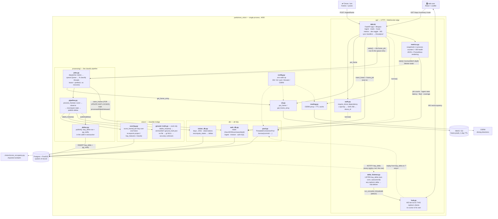

# PARKDRONE server — module map

The server is **one Python process** (`web/apps/vision-worker/parkdrone_vision`) that owns
both the web edge and the vision CV: FastAPI on `:4000` plus a pool of classify threads.
There is no broker and no second language — that is *why* the module layout looks the way it
does (see "Why it is split this way" below).

This file zooms **inside** the "PARKDRONE Server" component of
`web/docs/architecture.drawio`. An editable draw.io version of the same diagram lives next to
this file: **`docs/server_modules.drawio`**.

## Module diagram

Entry points (package root, not on the request path):

| Command | Module | What it does |
| --- | --- | --- |
| `python -m parkdrone_vision.server` | `server.py` | boots uvicorn on `API_PORT` with `api.app:app` |
| `python -m parkdrone_vision.register_drone <id>` | `register_drone.py` | mints an API key, stores **only** its SHA-256 |
| `python -m parkdrone_vision.replay <area>` | `replay.py` | golden test: frames → `pipeline.process_frame` → compare to `occupancy_results.json` (no server) |
| `API_KEY=… python -m parkdrone_vision.replay_ingest <area>` | `replay_ingest.py` | full-stack E2E over the real HTTP/WS contract |
| `API_KEY=… python -m parkdrone_vision.sim_uplink <area>` | `sim_uplink.py` | **live sidecar**: watches `sim/output/<area>/` and POSTs frames as a Webots flight writes them, so the map fills in mid-patrol. Reads only — the flight controller stays free of network code, and disk remains the source of truth for its resume logic |
| `python -m parkdrone_vision.cleanup` | `cleanup.py` | one frame-retention sweep by hand (the server also runs it every `CLEANUP_INTERVAL_S`); exits 1 if it found expired frames still unfinished (`queued` or `running`) |

Both ingest tools share `ingest_client.py` — one implementation of the multipart body, since that
is the wire format real drone firmware will have to reproduce.

The whole stack — infra, migrations, seed, server, both UIs — comes up with
`pnpm quickstart` from `web/` (`scripts/quickstart.sh`).

## What each module does

### `api/` — the HTTP and WebSocket edge

| Module | Responsibility |
| --- | --- |
| `app.py` | The FastAPI app and every route. **Ingest**: `POST /api/v1/ingest/mission/start`, `…/{id}/end`, `…/frame`. **Reads**: `GET /api/v1/bays` (GeoJSON, optional `bbox`/`zona`), `/summary`, `/bays/{id}`. **Directions**: `GET /api/v1/route`. **Metrics**: `GET /api/v1/metrics` (JSON, optional `window_s`), `GET /metrics` (Prometheus). **Dev toggle**: `POST /api/v1/dev/occupy\|free` (mounted unless `ENABLE_DEV_ROUTES=false`). **Realtime**: `WS /ws/occupancy`. Its `lifespan` opens the pool, loads bays as ENU rings, reports the claimable backlog, then starts the classify threads and the delta listener. There is no crash-recovery step any more: unfinished work is *claimed*, so the ordinary dispatcher poll picks it up — by this replica or by any other already running. Also normalises the pose's `frame_idx` once, at the edge, so nothing downstream needs a legacy-`i` fallback. |
| `auth.py` | `require_drone` FastAPI dependency: reads `x-api-key`, matches its SHA-256 against `drone.api_key_hash`, bumps `last_seen`, returns `drone_id`. 401 missing / 403 unknown. |
| `hub.py` | WebSocket fan-out to **this replica's** clients. `deliver(msg)` sends one already-published delta verbatim (its `type` tag and cursor were set at publish time) and drops dead sockets. It holds no cursor and no replay buffer — both moved to the `bay_delta` table so a reconnect resumes identically whichever replica it lands on; `connect()` just takes the replayed backlog the route read for it. |
| `delta_listener.py` | The subscribe half of the shared delta channel. A daemon thread with its own **autocommit** connection (LISTEN inside an open transaction only starts receiving once that transaction commits) blocked in `select()` on the connection socket, handing each notification to `hub.deliver` on the event loop. A replica hears its own deltas back through here too — one delivery path means every client sees one order. Reconnects itself on a dropped connection, because the failure mode otherwise is a replica whose clients silently stop updating while everything else looks healthy. |
| `metrics.py` | Operational snapshot for the admin dashboard and any scraper. Two halves: **in-process** (`jobs.stats()` — queue depth, in-flight, process-lifetime totals, mean classify time; these exist nowhere else and reset with the process) and **durable** (`web_db` — job status counts, oldest-queued age, ingest rates, enqueue→finish latency percentiles, fleet/mission progress, bay coverage, and model accuracy where ground truth exists — `state_accuracy` after the vote, `view_accuracy` before it, both `null` rather than `0` without labels). `prometheus(snap)` renders the numeric subset as text exposition — no client library; windowed DB figures are exported as gauges, only the lifetime process totals as counters. |

### `processing/` — frame → occupancy

| Module | Responsibility |
| --- | --- |
| `jobs.py` | The classify pipeline. Work is **pulled, not pushed**: one dispatcher thread claims rows (`web_db.claim_frames`) into a local `queue.Queue`, drained by `CLASSIFY_THREADS` daemon threads each owning its **own** long-lived psycopg2 connection (connections aren't thread-shareable). The local queue is kept shallow (`CLAIM_PREFETCH`) — a replica holding leases on work it will not start for minutes is the old imbalance under a new name. Each job: fetch the image → `process_frame` (which publishes its own deltas) → mark the job processed. A missing image is terminal on the first attempt; any other failure releases the lease for a retry and is given up on at `MAX_ATTEMPTS` with `last_error` recorded. `stats()` exposes the live counters (local depth, in-flight, processed/failed/**reclaimed**/deltas, mean classify time) that `api/metrics.py` reports. |
| `deltas.py` | The publish half of the shared delta channel. `publish(conn, deltas)` writes each delta to `bay_delta` (drawing its `id` — the global cursor — and folding it into the stored payload, so a replayed message and a live one are the identical object) and `pg_notify`s it, **inside the caller's transaction**. NOTIFY fires on COMMIT, so nothing is ever announced for state that rolled back. `replay()` reads a little *behind* a client's cursor because sequence ids are assigned before commit and can become visible out of order — a delta is idempotent, so over-replaying is free and missing one is not. |
| `pipeline.py` | The whole scoring transaction: resolve eval labels → `score_frame` → `insert_observations` → `recompute_states` → commit → return deltas. Shared verbatim by the live threads and the offline `replay.py`, which is what makes the golden test meaningful. Labels are looked up here rather than in each caller (`ground_truth.labels_for`, overridable with an explicit `gt=`) because they are a property of the survey area — so live ingest and replay both record them and accuracy is measured on the production path. |

### `vision/` — the classifier bridge

| Module | Responsibility |
| --- | --- |
| `scoring.py` | Puts `<repo>/vision` on `sys.path` and imports `score_occupancy` (side-effect free — its `main()` is guarded). Re-exports `project`, `bay_features`, `classify`, `to_enu`, `pose_idx` so the web tier **never re-implements the calibrated thresholds**. Adds `score_frame(img, bays, pose)`: for each bay, project its ring to pixels, skip if the bbox misses the frame or the core isn't visible enough, else classify and record the centre offset. |
| `ground_truth.py` | **Eval only.** `labels_for(survey_area)` → `{bay_id: occupied}` read from `sim/worlds/<area>.ground_truth.json` (plus the legacy bare `ground_truth.json` for `fmi_block`), which is what makes `observation.gt` — and therefore the accuracy figures on `/metrics` — non-empty. Caches hits **and misses**, since production is the miss case and must not re-stat the filesystem once per frame. The survey-area name arrives from the drone over HTTP and is about to become a file path, so it is whitelisted (`^[A-Za-z0-9_-]{1,64}$`), not escaped. No file → `gt = NULL` → accuracy reported as unknown, which is the correct production answer. |

### `db/` — all SQL in one place

| Module | Responsibility |
| --- | --- |
| `pool.py` | `ThreadedConnectionPool` (1–10) + a `borrow(commit=False)` context manager. Used by the sync request handlers, which Starlette runs in its threadpool — blocking psycopg2 never touches the event loop. Classify threads deliberately bypass this pool. |
| `web_db.py` | Web-edge SQL. Reads (`feature_collection`, `summary`, `detail`, `nearest_bay`) push geospatial predicates into PostGIS. Writes: `insert_frame` (idempotent on `(drone_id, survey_area, frame_idx)`, and creates the `frame_job` row in the *same* transaction), mission bookkeeping, `mark_frame_processed/failed`, `claim_frames` (`FOR UPDATE SKIP LOCKED` + a lease, with the reaper for lapsed leases as the same query's second arm), `release_frame_job`, `claimable_count`, plus the auth lookups. Metrics queries (`job_counts`, `ingest_rates`, `classify_latency`, `fleet_health`, `coverage_counts`) are bounded scans over the retention-swept tables, riding the existing `frame_received_idx` / `frame_job_status_idx`. |
| `vision_db.py` | Vision-side SQL: `load_bays_enu` (WGS84 → ENU rings), `insert_observations` (one row per scored bay, numpy scalars coerced to float), and `recompute_states` — strict-majority vote over a bay's observations, upsert `bay_state`, and return a delta only for bays that flipped or became known. |

### Package root — config and adapters

| Module | Responsibility |
| --- | --- |
| `config.py` | Walks up from CWD for the nearest `.env` (process env always wins) and exposes `DATABASE_URL`, the S3 settings, `SIM_OUTPUT_ROOT`, `API_PORT`, `ENABLE_DEV_ROUTES`, `CLASSIFY_THREADS`, `GROUND_TRUTH_ROOT`, and the OSRM/cache knobs. |
| `s3.py` | The single boto3 client both sides share: `put_frame` (ingest writes bytes, stores only the `s3://` uri on the frame row) and `get_frame_array` (classify threads read back an HxWx3 RGB array; also accepts a local path, which is how replay works). |
| `routing.py` | Proxies driving directions to OSRM so the driver's coordinates stay on our origin and the provider is swappable. Quantised-coordinate TTL cache absorbs the map's re-routes; `urllib` only (no new dependency), with a one-shot unverified retry for Windows' flaky cert revocation. Raises `RoutingError` → 502, and the map falls back to a straight line. |

## Why it is split this way

- **`api/` vs `processing/` is the thread boundary, not just a folder.** Everything in `api/`
  runs on request threads (or the event loop, for the WS endpoint); everything in
  `processing/` runs on the classify and dispatcher threads. The crossings are now
  `jobs.wake()` (a `threading.Event`, no DB) and the delta listener's
  `asyncio.run_coroutine_threadsafe(hub.deliver(...))` — note the second is no longer
  a classify thread reaching into the hub, but a notification arriving from Postgres.
- **`web_db.py` vs `vision_db.py` mirrors that same split**, which is why they don't share a
  connection strategy: web SQL borrows from `pool.py` per request, vision SQL uses one
  dedicated connection per classify thread.
- **`vision/scoring.py` exists so the classifier has exactly one home.** The tuned thresholds
  live in `vision/score_occupancy.py`; the server imports them rather than copying them, and
  `replay.py` proves the live path still agrees with the offline one.
- **`frame` (ledger) and `frame_job` (work state) are written in one transaction**, which is
  what lets an in-memory queue be durable: the dispatcher rebuilds it by claiming from
  Postgres + S3. See `docs/db_schema_er.md`.
