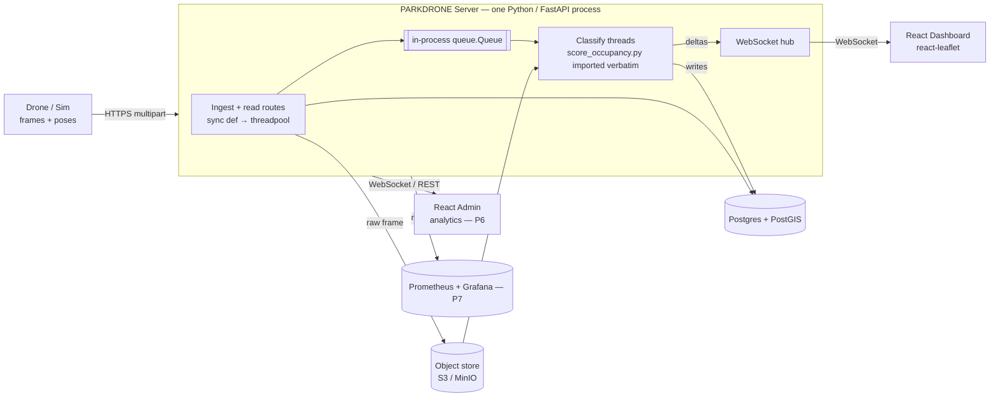

# PARKDRONE Web Infrastructure — Architecture & Requirements

> **Provenance.** Approved 2026-07-17; lived in `~/.claude/plans/witty-petting-ritchie.md` until
> 2026-08-02, when it moved here so the design doc is versioned with the code it describes.
> The July rearchitecture that collapsed the web tier into one Python process has its own
> companion doc: `docs/web_monolith_rearchitecture_plan.md`. Sections below have been rewritten
> to describe the **as-built** system; the superseded Node/Express + Redis design survives in the
> companion doc and in git history.

## Immediate next actions (agreed 2026-08-02)

Ahead of P6. Ordered — nothing should stack on an unverified schema change.

1. **Land the `frame.i` → `frame.frame_idx` rename.** The change is complete across the sim,
   `score_occupancy.py`, the server, the zod contracts and the schema docs, with migration
   `0004_frame_i_to_frame_idx.sql` untracked and unapplied. Bring infra up, run `pnpm db:migrate`,
   then both harnesses (`replay` = 43/43 + 100% vs GT, and the full `replay_ingest` E2E) before
   committing. `pose_idx` keeps legacy-`i` poses.json on disk replayable.
2. **Security sweep** — the three items under "Security follow-ups" below, plus a fourth found
   2026-08-02: `.env.example` and `web/.env` still carry `REDIS_URL` for the deleted Redis tier,
   the same dead-config problem as `JWT_SECRET`.
3. **Refresh this plan** — done in this edit: stale Node/Redis architecture text rewritten to the
   as-built shape, and a metrics prerequisite added to Segment 3 (P6).

## Context

PARKDRONE produces a **per-bay parking-occupancy report** (occupied vs. free) for a Sofia
city block. Today the whole pipeline is edge/offline: the Webots sim (soon a real drone)
captures nadir frames + poses, and the Python vision stage (`vision/score_occupancy.py`)
writes `occupancy_results.json` to disk. **Nothing transmits, serves, stores, or presents
that data** — there is no backend, API, DB, or frontend in the repo.

This plan defines the web infrastructure that turns that on-disk report into a live product,
across the three segments the user named:

1. **End-user dashboard** — a map that shows free vs. occupied parking in near-real-time.
2. **Ingest + processing API** — receives frames/poses from the drone, runs classification,
   persists occupancy, and pushes updates to dashboards.
3. **Admin analytics** — metrics/health for the operator running the fleet.

**Target:** production-scale architecture (multi-drone fleet, HA, auth). **Stack (user-chosen):**
~~Node/Express API~~ → **Python/FastAPI API** (changed 2026-07-28, see below), React + react-leaflet
dashboard, WebSocket push, **Postgres + PostGIS persistence from the start**.

### Persistence decision
Postgres + PostGIS is the store from day one (no SQLite phase). This fits the production target
directly: a fleet of drones writing concurrently needs a real multi-writer database, and PostGIS
gives native spatial indexing (`GiST` on bay geometry) so bbox/nearest-bay queries run in the DB
instead of the app layer. All access still goes through a thin repository interface, and the ENU
projection stays available in the app layer for pose math, but geospatial *queries* (bbox filter,
"free bays near me") push down into PostGIS `ST_*` functions. This removes the single-writer
bottleneck entirely and lets the API scale horizontally without a later migration.

### The Node/Python split — SUPERSEDED 2026-07-28
The original shape split a Node/Express edge from a Python vision worker, connected by a Redis
queue, because the calibrated classifier is **Python** (`vision/score_occupancy.py`: `to_enu`,
`project`, `load_bays`, `classify`) and rewriting it in Node would have thrown away the tuned
thresholds and the georeferencing code.

**That split has been removed.** The process boundary and the broker existed *only* because the
edge was Node and the classifier was Python; making the edge Python too dissolves the constraint.
The as-built system is **one FastAPI process** that imports the classifier and calls it in-process,
drains an in-process `queue.Queue` with dedicated classify threads (numpy releases the GIL, so the
CV genuinely parallelises off the event loop), and pushes deltas straight to the WebSocket clients
the same process holds. **No Redis.** Durability without a broker comes from re-enqueuing
`frame_job` rows with `status='queued'` on startup. Full reasoning:
`docs/web_monolith_rearchitecture_plan.md`; module-level view: `docs/server_modules.md`.

---

## High-level architecture

**Data flow (one frame):** drone POSTs frame + pose → ingest stores the raw image, records a
`frame` row **and its `frame_job` row in the same transaction**, puts a job on the in-process
queue → a classify thread projects every bay in view, classifies each, computes which bays changed
→ writes `observation` rows and recomputes `bay_state` → the resulting deltas are scheduled onto
the event loop (`run_coroutine_threadsafe`) and fanned out over WebSocket by the same process.

---

## Shared foundation: data model & coordinate contract

**Reuse the project's ENU spine — do not reinvent it.** `ORIGIN = (42.6747105, 23.3298956)`,
`MLAT = 111320.0`, `MLON = 111320.0*cos(ORIGIN_lat)`, defined identically in `generate_world.py`
and `score_occupancy.py:51-57`. Bays already carry lon/lat in `data/block_bays.geojson` (no
projection needed to place them on Leaflet). Poses (`x,y` ENU) convert back with the inverse:
`lon = ORIGIN_lon + x/MLON`, `lat = ORIGIN_lat + y/MLAT`. **Bay-id normalization:** ids are ints in
the geojson but strings in `ground_truth.json` / `occupancy_results.json` — the ingest/worker layer
must canonicalize to **string** everywhere.

**Persistence schema (Postgres + PostGIS):**

- `bay` — static geometry, seeded once from `block_bays.geojson`. Columns:
  `bay_id (PK, text)`, `zona`, `street (mestopoloz)`, `park_txt`, `bearing_deg`, `public (bool)`,
  `geom geometry(Polygon,4326)` (with a `GiST` spatial index), `centroid geometry(Point,4326)`.
  The raw polygon is loaded straight from the geojson via `ST_GeomFromGeoJSON`.
- `bay_state` — current occupancy, one row per bay: `bay_id (PK/FK)`, `occupied (bool)`,
  `confidence (real)`, `last_frame (int)`, `updated_at`, `source ('vision'|'manual')`.
- `observation` — append-only history for analytics: `id`, `bay_id`, `occupied`, `frame_idx`,
  `survey_area`, `votes_occupied`, `views`, `vis`, plus the raw feature stats from
  `occupancy_results.json` (`core_paint_frac`, `core_dark_frac`, `core_chroma`, `core_brightness`,
  `core_std`), `observed_at`.
- `frame` — append-only ingest ledger, never UPDATEd: `frame_id`, `drone_id`, `survey_area`,
  `frame_idx`, `x`, `y`, `alt`, `yaw`, `image_uri`, `received_at`.
- `frame_job` — the 1:1 classify work state, split out of `frame` in `0003`: `frame_id (PK/FK)`,
  `status ('queued'|'processed'|'failed')`, `enqueued_at`, `finished_at`. Written in the *same*
  transaction as its `frame`, so a committed ledger entry always has a recoverable job;
  `ON DELETE CASCADE` means clearing a survey area's frames clears its jobs.
- `drone` / `mission` — fleet registry: `drone_id`, `name`, `api_key_hash`, `last_seen`;
  `mission_id`, `drone_id`, `survey_area/area`, `started_at`, `ended_at`, `frames_expected`,
  `frames_done`.

> Naming note: `world` was renamed `survey_area` in migration `0002`, and `frame.i` →
> `frame.frame_idx` in `0004`. See `docs/db_schema_er.md` for the current ER diagram.

The `observation` and `frame` schemas are a direct superset of the existing `poses.json` pose
record and `occupancy_results.json` per-bay result — the worker maps one to the other.

---

## Segment 1 — Ingest + Processing API (Python / FastAPI)

**Responsibility:** the only entry point for drone data; validation, storage, queueing, classification,
and the real-time push hub — all in one process (`apps/vision-worker`, package `parkdrone_vision`,
uvicorn on :4000). All durable state is in Postgres + the object store; the queue is in-process and
rebuilt from Postgres on restart.

### REST endpoints (drone-facing, authenticated by per-drone API key)
- `POST /api/v1/ingest/frame` — multipart: the PNG frame + a JSON pose
  (`frame_idx,x,y,alt,yaw,roll,pitch,wp`, `survey_area`, `drone_id`). Stores image to object store,
  inserts `frame` + `frame_job` rows, enqueues a vision job, returns `202 { frame_id }`. Validates
  pose against the `poses.json` contract with a schema (zod on the TS side).
- `POST /api/v1/ingest/mission/start` / `/end` — bracket a survey run; sets `mission` counters so the
  admin view can show progress and detect stalls.
- `POST /api/v1/ingest/batch` — optional: gzipped tar of frames+poses for store-and-forward when the
  drone was offline (matches the current disk-based capture model, where the sim writes frames locally
  and could upload after landing).

### REST endpoints (consumer-facing, read)
- `GET /api/v1/bays?bbox=&zona=` — bay geometry + current state as GeoJSON FeatureCollection
  (each feature = bay polygon + `occupied`, `confidence`, `updated_at`). Feeds the map on first load.
- `GET /api/v1/bays/:id` — single bay detail + recent observation history.
- `GET /api/v1/summary` — counts of free/occupied per zone/street for headline stats.

### Real-time push
- `WS /ws/occupancy` — client subscribes (optionally with a bbox / zona filter); server streams
  `{type:'bay_delta', bay_id, occupied, confidence, updated_at}` messages whenever a classify thread
  reports a change. Initial state comes from `GET /bays`; the socket carries only deltas. Because the
  classifier runs in this same process, deltas reach the hub directly — no cross-process channel.
- Heartbeat/ping (uvicorn's default) + last-event replay on reconnect (client sends `since` cursor,
  served from the hub's bounded replay deque).
- **Scale-out caveat:** a single process fans out to its own clients only. Running multiple replicas
  would reintroduce the need for a shared channel between them — deferred to P7, and a reason to
  scale this process up before scaling it out.

### Queue + in-process vision
- **Queue:** a thread-safe `queue.Queue` drained by `CLASSIFY_THREADS` dedicated OS threads. Jobs
  carry `{frame_id, image_uri, pose, survey_area, frame_idx}`. numpy releases the GIL during the
  array work, so these threads do real CV in parallel without blocking the event loop.
- **Durability (replacing the broker's at-least-once):** on startup, re-enqueue every `frame_job`
  still `status='queued'`, rebuilding the payload by joining back to `frame` + the object store. A
  frame whose image has expired from the store is marked `failed` so recovery never loops on it.
- **Classification:** **imports the existing projection/classification code** (`project()`,
  `bay_features()`, `classify()` from `vision/score_occupancy.py`) via `vision/scoring.py`, with
  scoring refactored to run on a **single frame against the bays visible in it**. For each frame it
  computes per-bay predictions, writes `observation` rows, recomputes `bay_state` by majority vote,
  and returns deltas for the hub. Idempotent per `frame_id`.
- **Requirement — decouple from ground truth:** `score_occupancy.py` currently only scores bays that
  appear in `ground_truth.json` (`load_bays` filters by GT). In production there is no ground truth;
  the worker must classify **all bays whose core is ≥`MIN_VIS` visible in the frame**, and the `gt`
  field becomes optional (present only in sim/eval mode for accuracy metrics).

### Non-functional
- **Auth:** per-drone API keys (hashed, in `drone` table) for ingest; JWT/session for consumer+admin
  (not yet built — nothing in the current server reads a JWT).
- **Idempotency & ordering:** `(drone_id, survey_area, frame_idx)` unique; a duplicate ingest creates
  no job, so a re-send does not re-enqueue work. To reprocess a survey area, clear its `frame` rows.
- **Backpressure:** ingest returns 202 immediately; heavy CV never runs inline on the request path.
- **Rate limits + payload caps** on ingest; object-store lifecycle policy to expire raw frames.

---

## Segment 2 — End-user dashboard (React + react-leaflet)

**Responsibility:** show a citizen where free parking is, right now, on a map. Read-only, public
(or light auth). Vite + React + TypeScript + react-leaflet (MapLibre GL optional if vector tiles wanted).

### Requirements
- **Map view** centered on the block; bays drawn as polygons from `GET /bays` GeoJSON, colored by
  state: **green = free, red = occupied, grey = unknown/stale** (no recent view, `updated_at` beyond a
  freshness TTL). Confidence shown via opacity or a badge.
- **Live updates:** open `WS /ws/occupancy`, apply `bay_delta`s to the in-memory bay layer with a
  smooth color transition. Reconnect with backoff + `since` replay so a dropped socket self-heals.
- **Filters/UX:** filter by zone (`zona`) and street (`mestopoloz`); "free spaces near me" using
  browser geolocation → nearest free bays (client-side distance in ENU or Haversine); free-count badge
  per zone from `GET /summary`.
- **Bay detail:** click a bay → popup with street, zone, last-updated time, confidence, and (optional)
  the last frame crop from the object store.
- **Freshness honesty:** a bay not seen in the current patrol is *stale*, not *free*. Surface “last
  surveyed N min ago” prominently — the map must never imply live truth for un-surveyed bays.
- **Responsive + accessible:** mobile-first (this is a phone-in-the-car use case); color is backed by
  icon/label for color-blind users.

### Structure
- `apps/web-user/` — Vite React app. `src/api/` (REST client + typed contracts shared with the server),
  `src/ws/` (socket hook with reconnect), `src/map/` (BayLayer, LegendControl, LocateControl),
  `src/state/` (React Query for REST + a small store for the live delta overlay).

---

## Segment 3 — Admin analytics dashboard

**Responsibility:** operational visibility for whoever runs the fleet — is data flowing, is the
classifier trustworthy, what's the occupancy picture over time. Auth-gated (admin role).

### Requirements
- **Fleet/mission health:** live table of drones (`last_seen`, current mission, frames done/expected,
  ingest rate), stalled-mission alerts, per-mission coverage (bays surveyed vs. total in area).
- **Ingestion metrics:** frames/min, queue depth, worker processing latency, failure rate.
  > **Prerequisite (P6 blocker, noted 2026-08-02):** this originally assumed "Prometheus counters
  > the Node API and Python worker export". Neither exists — the server exposes only `/health`.
  > Queue depth is now trivially available in-process (`_q.qsize()`) and job outcomes are already
  > recorded in `frame_job.status`/`finished_at`, but nothing surfaces either. **A metrics endpoint
  > has to be built before this requirement can be met**; it is the natural first slice of P6, and
  > it overlaps with P7's observability bullet.
- **Model quality:** when ground truth is available (sim/eval runs), accuracy / precision / recall /
  confusion matrix per world, plus the `uncovered` bay list — computed from `observation` vs. `gt`.
  In production (no GT), track proxy signals: confidence distribution, votes-vs-views agreement,
  bays repeatedly flipping (instability), and `vis`/coverage gaps.
- **Occupancy analytics:** time-series occupancy by zone/street/hour (from `observation` history),
  heatmap of demand, peak-hour reports. This is where the append-only `observation` table pays off.
- **Data browser:** inspect a frame — its pose, the projected bays, the classifier feature stats
  (`core_paint_frac`, `core_chroma`, …) and the debug overlay image, to debug misclassifications.
- **Controls:** manual override of a bay's state (writes `bay_state.source='manual'`), re-queue a
  failed frame, decommission a drone key.

### Structure
- `apps/web-admin/` — separate Vite React app (or a routed section of a shared app) behind admin auth.
  Charting via Recharts/visx. Reuses the same typed API client package.

---

## Production concerns (cross-cutting)

- **Monorepo layout:** `packages/contracts` (shared TS types + zod schemas, the single source of truth
  for pose/bay/delta shapes), `packages/db` (migrations + seeder, dev tooling),
  `apps/vision-worker` (Python — the whole server), `apps/web-user`, `apps/web-admin` (P6),
  `infra/` (Docker + k8s manifests). The Node `apps/api` was deleted in the July rearchitecture; an
  empty `apps/api/` husk should be removed.
- **Deployment:** the server containerized as one image. k8s: HPA on it (CPU/conns — note that
  queue depth is now *internal*, so it is a scale-up signal, not a scale-out one). Object store
  (MinIO in-cluster or S3). Postgres + PostGIS runs as a managed instance (e.g. cloud Postgres with
  the PostGIS extension) or a StatefulSet with a persistent volume; connection pooling (PgBouncer)
  in front so replicas share the DB safely. CDN for the static React bundles and (optionally) frame
  thumbnails. **Scaling to >1 replica requires solving WebSocket fan-out across replicas first**
  (see the Segment 1 caveat) — the one thing the broker used to provide for free.
- **Observability:** structured logs, Prometheus metrics from the server, Grafana dashboards,
  alerting on queue backlog / classify failures / stalled missions. Nothing is exported today.
- **Security:** TLS everywhere; drone API keys hashed at rest and rotatable; JWT for users/admins with
  role separation; ingest input validation + size limits; object-store presigned URLs for frame access.
- **CI/CD:** lint/typecheck/test per package; build+push images; the repo currently has *no* test suite,
  so this introduces one (contract tests on the API, a golden-frame test for the vision worker against a
  known `occupancy_results.json`).

---

## Security follow-ups (found 2026-07-30, still open)

Audited against the current `web/` tree — the generic "Security:" bullet under Production
concerns above predates these concrete findings; this is the actionable list for Phase 7.

- **Hardcoded, committed credentials in `web/infra/docker-compose.yml`:** `POSTGRES_PASSWORD:
  parkdrone` and `MINIO_ROOT_USER/PASSWORD: minioadmin` are baked directly into the compose file
  instead of being sourced from `.env`/a secret. `web/.env.example` mirrors the same defaults
  (`DATABASE_URL` with `parkdrone:parkdrone`, `S3_ACCESS_KEY`/`S3_SECRET_KEY=minioadmin`) — fine as
  a *template*, but nothing forces these to be rotated before a real deployment, and the compose
  file itself has no override mechanism (no `${POSTGRES_PASSWORD}` interpolation from env). The
  real `web/.env` is correctly gitignored and not committed.
- **`JWT_SECRET=dev-change-me` in `.env.example` is dead config** — leftover from the retired
  Node/JWT auth design; nothing in the current Python server (`parkdrone_vision`) reads it. Remove
  it, or wire it up if/when user/admin auth (Segment 3) actually needs sessions.
- **Dev-toggle endpoints are unauthenticated and on by default.** `ENABLE_DEV_ROUTES` in
  `apps/vision-worker/parkdrone_vision/config.py` defaults to `"true"`, and `POST
  /api/v1/dev/occupy`/`/free` (`api/app.py`) have no auth check at all — anyone who can reach
  `:4000` can flip any bay's occupancy. Needs to default to `false` outside dev, or at minimum
  require the same drone API-key auth as ingest before this goes anywhere reachable from outside
  localhost.

**Remediation — status as of 2026-08-02:**
1. ✅ **Done.** `docker-compose.yml` now interpolates every credential from `web/.env` with the
   fail-loud `${VAR:?message}` form; no literal secret remains in the committed file. MinIO's root
   credentials reuse `S3_ACCESS_KEY`/`S3_SECRET_KEY` rather than a third copy that could drift.
   The `infra:up`/`infra:down` scripts pass `--env-file .env` explicitly, because Compose otherwise
   resolves `.env` relative to the *compose file's* directory (`web/infra/`), not `web/` — without
   it the stack fails on the `:?` guard.
2. ✅ **Done.** `JWT_SECRET` dropped from `.env.example` and `web/.env`. `REDIS_URL` dropped in the
   same sweep — same dead-config class, left over from the deleted Redis tier.
3. ✅ **Done.** `ENABLE_DEV_ROUTES` now defaults to `false` (`config.py`); `.env.example` opts local
   dev in explicitly. Gating the endpoints behind the drone API key remains **open** — required
   before they're exposed beyond localhost.
4. ⬜ **Open.** Once out of local dev, move DB/object-store credentials to a real secret store
   rather than any `.env` file at all.
5. ⬜ **Open — found 2026-08-02 during the sweep.** `config.py` still carries *code-level* fallback
   defaults for the same secrets: `DATABASE_URL` defaults to `postgres://parkdrone:parkdrone@…`
   (line 36) and `S3_ACCESS_KEY`/`S3_SECRET_KEY` default to `minioadmin` (lines 44–45). So a server
   started without `.env` silently comes up on well-known credentials instead of refusing. Same
   class as item 1, but fixing it changes startup behaviour for the CLI harnesses
   (`replay`, `register_drone`), so it was left for a deliberate decision rather than folded into
   this sweep.

---

## Suggested build order (phased)

1. **Contracts + DB + seed:** define shared schemas; Postgres + PostGIS schema + migrations
   (enable the PostGIS extension, `GiST` index on `bay.geom`); a seeder that loads
   `block_bays.geojson` into `bay` via `ST_GeomFromGeoJSON` (reusing the id-normalization rules).
2. **Vision worker extraction:** refactor `score_occupancy.py`'s per-frame loop into a callable that
   scores one frame → per-bay predictions, decoupled from `ground_truth.json`. Wrap as a queue consumer.
3. **Ingest API + queue + object store:** `POST /ingest/frame` → store → enqueue; classify threads
   write state.
4. **State/read API + WebSocket:** `GET /bays`, `/summary`; in-process delta push → `WS /ws/occupancy`.
5. **User dashboard:** map + live deltas + filters.
6. **Admin dashboard:** health, metrics, model quality, occupancy analytics.
7. **Prod hardening:** auth, metrics/Grafana, containers/k8s, connection pooling, CI.

---

## Verification

Because this is a from-scratch system, verification is per-phase, driven end-to-end against the
**existing sim outputs** as the test fixture (`sim/output/fmi_block/poses.json` +
`occupancy_results.json` + `sim/worlds/*.ground_truth.json`):

- **Seed check:** after seeding, `GET /bays` returns a FeatureCollection whose bay count and polygons
  match `block_bays.geojson`, ids normalized to strings.
- **Worker golden test:** feed the frames referenced in `poses.json` through the worker and assert the
  resulting `bay_state` matches the committed `occupancy_results.json` predictions (and, in eval mode,
  the accuracy vs. `ground_truth.json` matches the current script's numbers) — proves the refactor
  preserved the classifier.
- **Ingest→push loop:** a script replays `poses.json` + `frame_###.png` to `POST /ingest/frame` in
  order; a WebSocket test client asserts it receives `bay_delta` messages and that final map state
  equals the batch result. This simulates a live patrol without the drone.
- **Dashboard smoke:** load the React app against the replay, confirm bays render green/red/grey and
  flip live as deltas arrive; verify stale-bay handling by withholding some frames.
- **Admin smoke:** confirm fleet/mission counters, ingestion metrics, and (eval-mode) accuracy/confusion
  matrix populate from the replay.
- **Load sanity:** replay at Nx speed / multiple simulated drones (concurrent writers) to check queue
  depth, worker latency, WebSocket fan-out, and Postgres write throughput / connection-pool behavior.

---

## Follow-up enhancements (dashboard, post-P5)

Shipped after the initial P5 dashboard: CARTO Positron basemap, "survey-readout" visual identity,
geolocation (Locate-me) + nearest-free-spot (defaults to `FMI_DEFAULT`), and dev/test occupy/free
endpoints (`POST /api/v1/dev/occupy|free`) that drive the map live.

### Next: driving directions to the nearest free spot
When a nearest free bay is selected (the car FAB), offer a **"Directions"** action that navigates
the driver there. Approach:
- **Primary (no dependency):** deep-link to Google Maps directions with the user's location as
  origin and the bay centroid as destination, driving mode —
  `https://www.google.com/maps/dir/?api=1&origin=<lat>,<lon>&destination=<bayLat>,<bayLon>&travelmode=driving`
  (opens the native Maps app on mobile, google.com/maps on desktop). Add the button to the
  nearest-free toast and the target bay's popup. This is the fastest, zero-infra option.
- **In-app route line (optional, later):** replace the straight dashed line with an actual road
  route via a routing service (OSRM public demo server, or self-hosted OSRM on the OSM extract the
  project already downloads in `block_roads.geojson`) and draw the returned polyline + show
  distance/ETA. Keep the Google Maps deep-link as the "navigate" handoff.
- Respect that the you-are-here may be `FMI_DEFAULT` (demo) vs. real GPS — directions use whatever
  `userPos` currently is.
